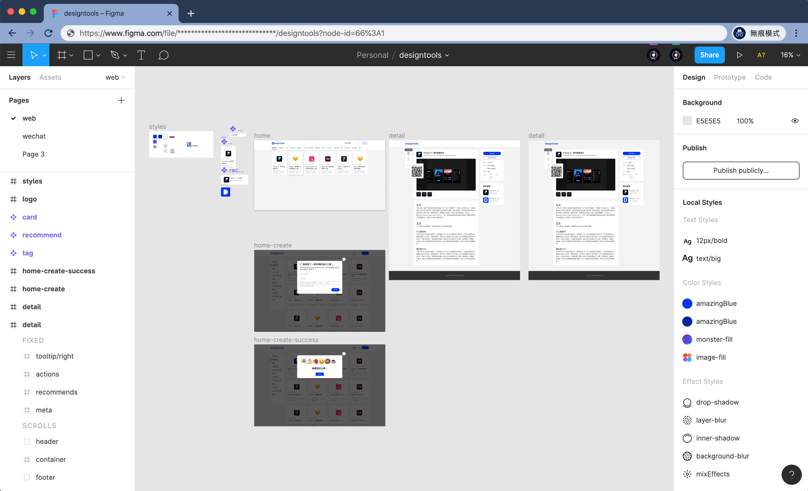

# 设计协作管理工具

>本章节作者 [Leadream](https://sspai.com/u/leadream/posts)

由于性能原因设计工具一般都是本地客户端，但是近几年在数字界面设计领域出现了很多基于 Web 端的设计工具，为设计协作提供了更多可能性。对于设计师来说，除了设计团队之间的协作之外，还有和上下游之间的协作，设计工具的好用与否决定了团队间的工作效率。

## 设计工具
最近几年是设计工具井喷的几年，很多新的界面设计工具诞生，给了我们更多的选择。

### Figma
[Figma](https://www.figma.com/) 无疑是设计协作的首选工具，它把界面设计这件事从本地搬到了云端。无需繁琐的文件管理，所有的文件都存储在云端，**自动历史记录可以让你随时恢复到老板最喜欢的第一版**。

Figma 除了方便设计团队内的协作，还支持交付功能，只需要把文件链接发给开发他们就能看到设计标注了。当然，除了基于 Web 带来的易于分享和协作的特性，Figma 本身使用体验也非常好，即使在浏览器中也十分顺滑，还有很多符合直觉的操作细节，可以让设计师完全专注于设计本身而不用克服工具带来的阻碍。

### Sketch
[Sketch](https://www.sketch.com/) 是使用比较广泛的一款设计工具，支持组件式设计，但是它是客户端，设计文件需要通过云功能同步。

## 交付工具
除了自己的砍柴刀要趁手，在交付给开发时也需要一个好用的工具。Sketch 不带交付功能，因此需要选择第三方工具，而 Figma 虽然有交付功能，但只能生成参考代码，如果需要更精细的功能也需要第三方工具。

### 蓝湖
[蓝湖](https://lanhuapp.com/)是国内比较受欢迎的一款设计交付工具，可以生成在线标注，支持 Photoshop、Adobe XD 和 Sketch，也支持托管 Axure 文档。

### 像素大厨
[像素大厨](https://fancynode.com.cn/pxcook)是另一款国内设计交付工具，支持 Photoshop、Adobe XD 和 Sketch，内测版支持 Figma。

### Zeplin
[Zeplin](https://zeplin.io/) 是国外的一款比较老牌的设计交付工具，功能齐全，还支持整个设计文件的设计样式生成。目前 Zeplin 支持 Figma、Photoshop、Adobe XD 和 Sketch。

### Sympli
[Sympli](https://sympli.io/) 是一个设计协作和版本控制工具，支持 Figma、Photoshop、Adobe XD 和 Sketch 文件导入，还支持和 XCode、Android Studio、Jira、Slack 的整合。

### Avocode
[Avocode](https://avocode.com/) 也是一款比较老牌的设计交付工具，支持 Photoshop、Adobe AI、Adobe XD 和 Sketch 文件导入，还支持原型生成。

### Abstract
[Abstract](https://www.abstract.com/) 将代码的版本控制概念引进设计领域，通过 Git 的工作流来进行设计文件的版本控制。这么做的好处是设计文件版本管理更加科学合理，但是对于设计师来说上手门槛有点高，需要搞懂 Git 的基本流程，同时也比较容易占用存储空间。
